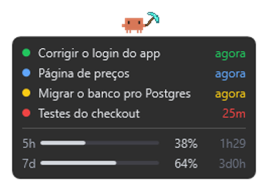

# Claude Monitor

Uma janelinha que fica sempre por cima, no canto da tela, mostrando as suas
sessões do Claude Code e quanto do seu limite você já gastou. Dá pra deixar 3,
4 sessões rodando e ir fazer outra coisa: quando uma termina ou precisa de
você, ela avisa com um som.



**[⬇️ Baixar o ClaudeMonitor.zip](https://github.com/LucasM-Maciel/ticlins-claude-monitor/releases/latest/download/ClaudeMonitor.zip)** (Windows e Mac no mesmo arquivo)

## O que ela mostra

| Bolinha | Quer dizer |
|---|---|
| 🟢 verde | trabalhando |
| 🔴 vermelha | terminou |
| 🔵 azul | te fez uma pergunta |
| 🟡 amarela | pedindo permissão pra rodar algo |

- **O tempo à direita**: há quanto tempo a sessão está assim.
- **5h e 7d**: o mesmo que o `/usage` do Claude Code mostra (o limite de 5
  horas e o da semana), com quanto falta pra renovar. Fica laranja em 80% e
  vermelho em 95%.
- **O Clawd** (o bichinho laranja): anda em volta minerando quando alguma
  sessão está rodando, pula quando alguém está esperando você e fica parado
  quando está tudo quieto.
- **Som**: quando uma sessão termina ou precisa de você, e um som especial
  quando termina a última (tudo pronto).
- **Dentro do VS Code**: uma aba "Claude Monitor" na barra lateral com as
  sessões (clique numa pra ir direto nela) e um contador na barra de status.

## Como instalar

Precisa ter:

- **Claude Code** logado com a sua conta do Claude (Pro/Max). O usage não
  aparece se você usa chave de API.
- **VS Code** (ou Cursor).
- **Node.js**, versão LTS: [nodejs.org](https://nodejs.org). É ele que o Claude
  Code usa pra avisar a janelinha.

### Windows

1. [Baixe o ClaudeMonitor.zip](https://github.com/LucasM-Maciel/ticlins-claude-monitor/releases/latest/download/ClaudeMonitor.zip).
2. Botão direito no arquivo > **Extrair tudo**.
3. Dentro da pasta extraída, dê duplo clique em **`instalar-windows.cmd`**.
   Se aparecer "O Windows protegeu o computador", clique em
   **Mais informações > Executar assim mesmo**.
4. Feche e abra o VS Code.

### Mac

1. [Baixe o ClaudeMonitor.zip](https://github.com/LucasM-Maciel/ticlins-claude-monitor/releases/latest/download/ClaudeMonitor.zip)
   e dê duplo clique nele (o Mac extrai sozinho).
2. Abra o **Terminal** (`Cmd + Espaço`, digite *Terminal*, Enter).
3. Digite `bash ` (com um espaço no fim), **arraste o arquivo
   `instalar-mac.sh`** pra dentro da janela do Terminal e aperte Enter.
4. Feche e abra o VS Code.

Na primeira vez, o Mac pode pedir pra instalar as **ferramentas de linha de
comando**. Clique em Instalar, espere terminar (uns minutos) e repita o passo 3.

Se o Mac perguntar se **"security" pode acessar "Claude Code-credentials"**,
clique em **Permitir Sempre**. É só a janelinha lendo o seu usage.

Pronto: a janelinha aparece no canto de baixo à direita. As sessões do Claude
que já estavam abertas precisam ser reabertas pra aparecer; as novas aparecem
sozinhas.

## Como usar

- **Mover**: clique e arraste.
- **Ir pro VS Code**: duplo clique na janelinha.
- **Fechar**: botão direito > Fechar.
- **Reabrir**: no VS Code, `Ctrl+Shift+P` (Mac: `Cmd+Shift+P`) >
  **Claude Monitor: Abrir janelinha flutuante**. No Windows também tem o
  atalho "Claude Monitor" na Área de Trabalho.
- **Desligar a janelinha** e ficar só com a barra lateral: nas configurações
  do VS Code, desmarque **Claude Monitor: Overlay**.

### Sons do Minecraft (opcional)

Quem tem o **Minecraft Java** instalado pode trocar os sons pelos do jogo: o
"hmm" do aldeão quando alguém espera você, o som de XP quando uma sessão termina
e o de **subir de nível** quando termina a última (nada mais rodando nem esperando
você). A picareta de diamante do Clawd também vira a do jogo. Precisa do ffmpeg:

- Windows: `winget install Gyan.FFmpeg`
- Mac: `brew install ffmpeg`

Depois, no VS Code: `Ctrl+Shift+P` > **Claude Monitor: Usar sons do Minecraft**.
Os sons não vêm no pacote porque são da Mojang: cada um tira do próprio jogo.

## Deu problema?

**Nenhuma sessão aparece.** Reabra as sessões do Claude (a janelinha só vê as
abertas depois da instalação). Se continuar, confira se o Node.js está
instalado: abra um terminal e rode `node -v`.

**"usage indisponível".** Espere 2 minutos, que ela tenta de novo. Se não
voltar, confira se o Claude Code está logado com a conta do Claude (`/login`),
e não com chave de API.

**A janelinha sumiu.** `Ctrl+Shift+P` > **Claude Monitor: Abrir janelinha
flutuante**.

**A bolinha está errada** (amarela sem pedir nada, por exemplo). Tire um print
e mande pra quem te passou o Claude Monitor.

## O que ela acessa

Tudo fica no seu computador. A janelinha lê os arquivos que o Claude Code já
grava (`~/.claude`) e usa o seu próprio login pra perguntar o usage ao mesmo
endereço que o `/usage` usa (`api.anthropic.com`). Ela nunca renova nem manda
o seu login pra outro lugar.

A instalação:

- acrescenta 4 hooks no `~/.claude/settings.json` (guarda uma cópia do anterior
  em `settings.json.bak-claude-monitor`);
- cria a pasta `~/.claude-monitor`.

## Desinstalar

1. No VS Code, desinstale a extensão **Claude Monitor**.
2. Apague a pasta `~/.claude-monitor` (Windows: `C:\Users\<você>\.claude-monitor`).
3. No `~/.claude/settings.json`, apague os hooks que citam `.claude-monitor`.

## Pra quem quer mexer no código

```bash
npm ci
npm run empacotar   # monta dist/ClaudeMonitor.zip e o .vsix
npm run testar      # testes da extensão (Node)
powershell -ExecutionPolicy Bypass -File testes/windows/testes.ps1   # Windows
bash testes/mac/testes.sh                                            # Mac
```

- `extensao/`: a extensão do VS Code, com a janelinha em `extensao/janelinha/`
  (Windows: `overlay.ps1`; Mac: `overlay.swift`).
- `instalar/`: os instaladores.
- `testes/cenarios.js`: as situações que a janelinha tem que acertar nos dois
  sistemas.

A cada push, o GitHub testa o pacote num Mac e num Windows de verdade. Uma tag
`v*` publica o .zip na página de download.
